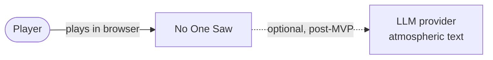
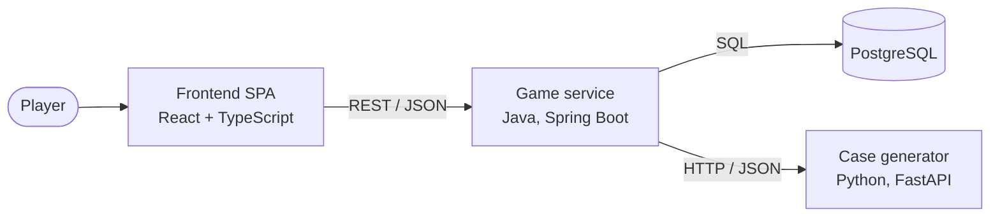
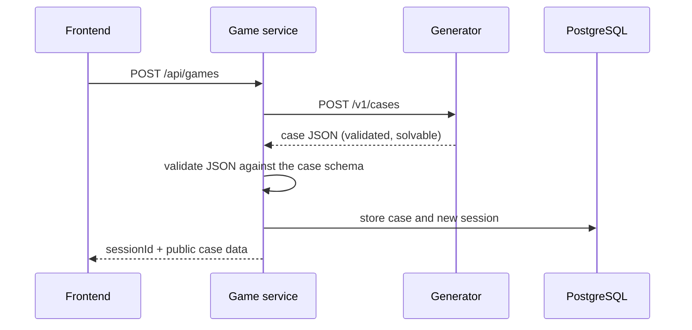
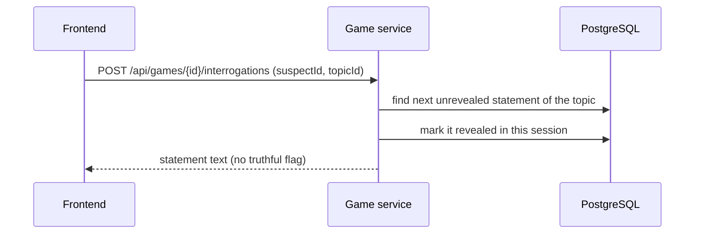
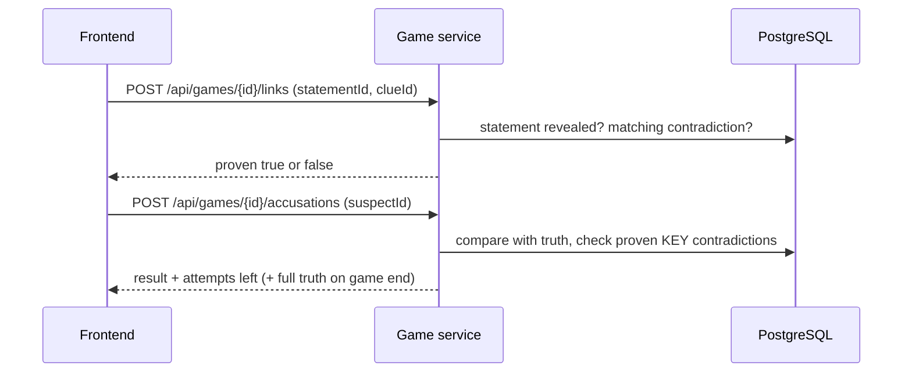

# Architecture

Version 0.1 · Status: proposed · Terms follow [gdd.md](gdd.md), data follows [domain-model.md](domain-model.md)

## Overview

No One Saw is a web application made of three runtime components and a database:

- **Frontend (SPA):** React + TypeScript. Shows the investigation board and the interrogation panel.
- **Game service:** Java, Spring Boot. Owns game state and all game rules. The only component that talks to the database and the only one the browser talks to.
- **Case generator:** Python, FastAPI. Stateless. Generates and validates a case on request.
- **Database:** PostgreSQL. Stores cases and game sessions.

The browser never talks to the generator, and never receives hidden data (truth, contradictions, lie flags).

## System context

## Containers

| Container | Responsibility | Talks to |
|---|---|---|
| Frontend SPA | Board UI, interrogation panel, drag and drop, keeps the session id in the browser | Game service |
| Game service | Sessions, statement reveal, thread verification, accusation evaluation, case storage and schema validation | PostgreSQL, case generator |
| Case generator | Builds a case (truth, suspects, clues, statements, contradictions) and checks it is solvable | none (stateless) |
| PostgreSQL | Case content and game state | Game service |

## Key flows

### New game

If the generator cannot produce a valid case within its retry limit, it returns an error and the game service reports a failure to the client.

### Interrogation

### Drawing a thread and accusing

## API outline

Contract-first: the OpenAPI file is written before the code (see ADR 0004).

### Game service (public, used by the frontend)

| Method and path | Purpose |
|---|---|
| `POST /api/games` | Start a new game: generates a case, creates a session |
| `GET /api/games/{id}` | Current state: public case data, revealed statements, proven contradictions, attempts left |
| `POST /api/games/{id}/interrogations` | Reveal the next statement of a suspect's topic |
| `POST /api/games/{id}/links` | Check a thread between a statement and a clue |
| `POST /api/games/{id}/accusations` | Make an accusation |

### Case generator (internal, used only by the game service)

| Method and path | Purpose |
|---|---|
| `POST /v1/cases` | Generate and return one validated case |
| `GET /health` | Health check |

The generator publishes the **JSON Schema** of the case (generated from its Pydantic models). The game service validates every received case against it, so a bug in either component cannot corrupt stored data silently.

## Decisions

| ADR | Decision |
|---|---|
| [0001](adr/0001-monorepo.md) | Monorepo |
| [0002](adr/0002-generator-as-separate-service.md) | Case generator is a separate service, called on demand |
| [0003](adr/0003-postgresql-and-flyway.md) | PostgreSQL with Flyway migrations |
| [0004](adr/0004-rest-and-contract-first-openapi.md) | REST API, OpenAPI contract first |
| [0005](adr/0005-anonymous-session-id.md) | Anonymous session id instead of accounts |
| [0006](adr/0006-spa-with-react-flow.md) | React SPA with React Flow for the board |

## Questions from docs/stack.md that are now answered

- *How the game service gets cases from the generator:* HTTP call on demand (ADR 0002).
- *Where case data lives and in what shape:* PostgreSQL, relational tables that follow the domain model (ADR 0003).
- *How interrogation fragments are stored and revealed:* all statements are stored with the case; the server reveals them one by one per session (flow above).

## Still open

- Deployment target for the public demo.
