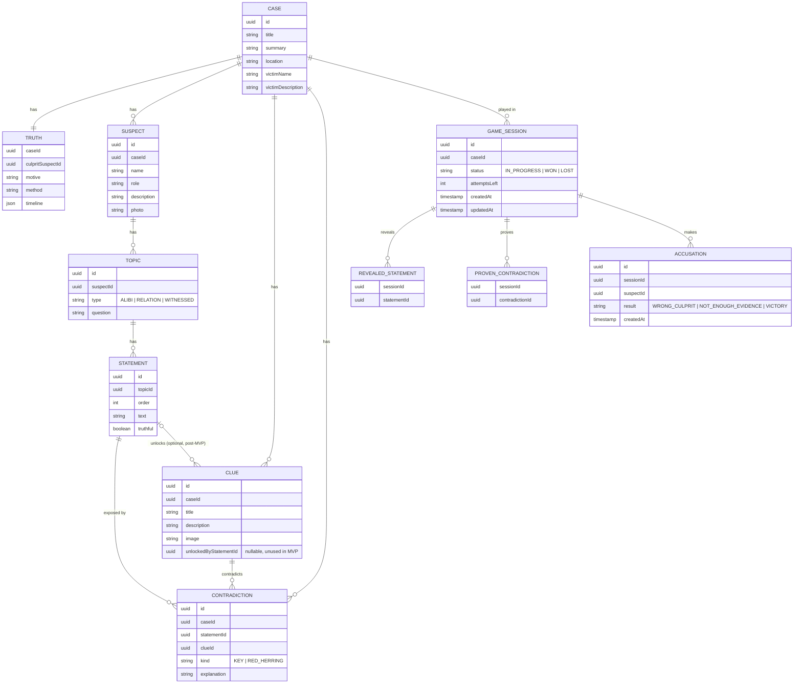

# Domain model

Version 0.1 · Terms follow the glossary in [gdd.md](gdd.md)

The model is split into two groups:

- **Case content**: created by the generator, never changes during play.
- **Game state**: changes as the player progresses.

## Diagram

## Entities

### Case content

| Entity | Purpose |
|---|---|
| **Case** | One playable case: summary, location, victim |
| **Truth** | What really happened: culprit, motive, method, timeline |
| **Suspect** | A person who can be interrogated |
| **Clue** | An item or fact shown on the board. `unlockedByStatementId` is empty in the MVP (all clues are visible from the start); filling it later makes a clue appear after a given statement is revealed |
| **Topic** | A question subject for a suspect (alibi, relation to the victim, what they saw) |
| **Statement** | One fragment of an answer; `order` defines the reveal sequence inside a topic; `truthful` marks lies |
| **Contradiction** | A valid "statement - clue" pair that exposes a lie. `KEY` exposes the culprit, `RED_HERRING` exposes an innocent suspect's unrelated lie |

### Game state

| Entity | Purpose |
|---|---|
| **GameSession** | One playthrough of a case. Its `id` is an anonymous identifier kept in the browser (no accounts), so progress survives closing the tab |
| **RevealedStatement** | Which statements the player has already unlocked |
| **ProvenContradiction** | Which threads the player drew and the system confirmed |
| **Accusation** | One accusation attempt and its result |

## Rules

### Visibility
`Truth`, `Contradiction` and `Statement.truthful` are **server-side only** and are never sent to the client. The client receives only revealed statements, clues, suspects and the player's own proven contradictions.

### Drawing a thread
1. The client sends `statementId` + `clueId` for a session.
2. The server checks that the statement is revealed in this session.
3. The server looks for a matching `Contradiction`.
   - Found: store a `ProvenContradiction`, return "lie proven".
   - Not found: return "no contradiction"; nothing is stored, no penalty.

### Accusation
1. The client sends `suspectId` for a session (the server uses the session's proven contradictions as evidence).
2. If `suspectId` is not `Truth.culpritSuspectId`: result `WRONG_CULPRIT`, session `LOST`.
3. Otherwise, if the session has no proven contradiction with `kind = KEY`: result `NOT_ENOUGH_EVIDENCE`, `attemptsLeft` decreases by 1; at 0 the session is `LOST`.
4. Otherwise: result `VICTORY`, session `WON`.

### Case invariants (checked by the generator's validator)
- Exactly one culprit per case.
- At least one `KEY` contradiction pointing to the culprit; its statement and clue are reachable by the player.
- A `RED_HERRING` contradiction never points to the culprit.
- Every `Contradiction` references a statement and a clue of the same case.

## Notes for later
- Confronting suspects with clues will need a `Reaction` entity (suspect + clue -> response text).
- Difficulty modes can be added as a field on `GameSession` (for example `autoHighlightLies`).
